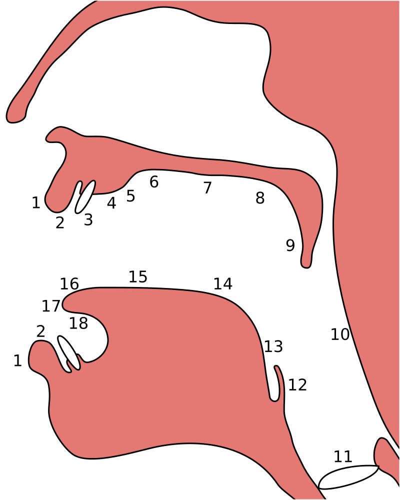

.. _guide_de_prononciation:

Guide de prononciation
======================

.. contents::

Nous allons nous intéresser ici à comment prononcer l'ensemble des sons 
réalisables en **tunisien**.

Principes généraux
------------------

Avant d'attaquer directement la prononciation dans le cadre de l'apprentissage
du tunisien, il est nécessaire de dresser quelques principes généraux afin de
faciliter la lecture de ce guide.

Consonnes
~~~~~~~~~

Consonne sourde et consonne sonore
^^^^^^^^^^^^^^^^^^^^^^^^^^^^^^^^^^

Il est possible de catégoriser chaque consonne en **deux catégories** : les 
consonnes **sourdes** et les consones **sonores**. Une consonne est dite 
**sourde** (ou *non-voisée*) si les **cordes vocales** ne sont pas sollicitées 
pour la prononcer ; à l'inverse, une consonne est dite **sonore** (ou *voisée*)
si elles le sont.

On peut alors définir des pairs de consonnes dont la seule différence est le
**voisement** :

.. list-table:: Voisement des consonnes
    :header-rows: 1

    * - Consonne sourde
      - Consonne sonore
    
    * - **[s]** - *sceau*
      - **[z]** - *zoo*
      
    * - **[p]** - *poids*
      - **[b]** - *bois*
      
    * - **[t]** - *toit*
      - **[d]** - *doigt*

Point d'articulation
^^^^^^^^^^^^^^^^^^^^

Le **point d'articulation** désigne les zones de la cavité buccale où 
l'air est obstrué afin de pouvoir prononcer un son. Il est par exemple possible de
produire des sons différents en ne changeant que la **position** de la langue
dans la cavité buccale, et gardant toute autre chose similaire par ailleurs.

Il existe beaucoup de points d'articulation différents dans les langues du monde,
qui sont réalisés lorsque deux zones se rapprochent où rentre en contact. On
distingue des points d'articulation en fonction de la paire de zones impliquées,
qui se décompose en **lieu d'articulation** (partie supérieure, l'endroit où 
l'air est obstrué) et l'**organe articulatoire** (partie inférieure, l'organe qui 
contraint l'air). La figure ci-dessous numérote l'ensemble des zones tel qu'on 
peut le retrouver en **phonétique articulatoire**.

En **tunisien**, uniquement certains **points d'articulation** sont présents, 
Ne sont donc présentés ci-dessous que les points d'articulation qu'on y retrouve.

.. list-table:: Points d'articulation présents en tunisien
    :header-rows: 1

    * - Point d'articulation
      - Lieu d'articulation
      - Organe articulatoire
      - Exemple
    
    * - Bi-labial
      - 2
      - 2
      - arab|`m` /m/
      
    * - Labio-dental
      - 3
      - 2
      - arab|`f` /f/

    * - Dental
      - 3
      - 17
      - arab|`<th>` /tun|`<th>`/

    * - Alvéolaire
      - 4
      - 17
      - arab|`t` /t/
    
    * - Post-alvéolaire
      - 5
      - 17
      - arab|`<vs>` /tun|`<vs>`/
      
    * - Vélaire
      - 8
      - 14
      - arab|`k` /k/
      
    * - Uvulaire
      - 9
      - 14
      - arab|`q` /q/
      
    * - Pharyngal
      - 10
      - 13
      - arab|`<ca>` /tun|`<ca>`/

    * - Glottal
      - 11
      - 11
      - arab|`<A>` /'/

Mode d'articulation
^^^^^^^^^^^^^^^^^^^

Le **mode d'articulation** désigne un ensemble de propriétés relative à 
l'articulation d'une consonne, notamment le **type d'obstruction** au passage 
de l'air ou le **canal vocal** utilisé.

A l'instar des **points d'articulation**, il existe beaucoup plus de modes 
d'articulation dans les langues du monde qu'en **tunisien**. Le tableau 
ci-dessous présente les **modes** que l'on retrouve dans ce dernier.

.. list-table:: Modes d'articulation présents en tunisien
    :header-rows: 1

    * - Mode d'articulation
      - Description
      - Exemple
    
    * - Consonne nasale
      - Passage de l'air dans le canal nasal
      - arab|`m` /m/
      
    * - Consonne occlusive
      - Blocage complet de l'air **avec** accumulation de pression
      - arab|`t` /t/

    * - Consonne battue
      - Blocage complet de l'air **sans** accumulation de pression
      - arab|`r` /r/

    * - Consonne fricative
      - Resserrement des organes d'articulation sans blocage complet d'air **avec** bruit de friction
      - arab|`s` /s/
      
    * - Consonne spirante
      - Resserrement des organes d'articulation sans blocage complet d'air **sans** bruit de friction
      - arab|`y` /y/

Consonne emphatique
^^^^^^^^^^^^^^^^^^^

Certaines consonnes en tunisien sont dites **emphatiques**, ou encore 
**pharyngalisées**. Il s'agit d'une prononciation secondaire qui vient 
accompagner la réalisation d'une autre consonne. Ces consonnes-ci se retrouvent
dans la plupart des langues sémitiques et quasiment exclusivement à celles-ci.  

Cette articulation secondaire particulière peut-être réalisée en **contractant
le pharynx** en prononçant la consonne (référez-vous au point d'articulation
**pharyngal** vu plus haut). 

En pratique, pour le son **[s]** emphatique, noté **[sˤ]**, sa prononciation se
rapproche beaucoup du *ça* du français canadien.

Voyelles
~~~~~~~~

Degré d'ouverture
^^^^^^^^^^^^^^^^^

Le **degré d'ouverture** d'une voyelle, aussi appelé **hauteur**, décrit la 
position verticale de la langue lors de la réalisation de la voyelle.

L'alphabet phonétique international différencie *sept* degrés différents, mais
seuls **cinq** d'entre eux sont présents en tunisien : 

* Voyelles **fermées** , comme dans f\ **i**\ lle;
* Voyelles **pré-fermées**, comme dans s\ **i**\ x en *français canadien* ;
* Voyelles **moyennes**, comme dans l\ **e** ;
* Voyelles **mi-ouvertes**, comme dans c\ **è**\ pe ;
* Voyelles **ouvertes**, comme dans l\ **a**.

Point d'articulation
^^^^^^^^^^^^^^^^^^^^

Le **point d'articulation** d'une voyelle décrit la position horizontale de 
la langue lors de la réalisation de la voyelle (vers l'avant ou l'arrière de 
la bouche).

L'alphabet phonétique international différencie *cinq* points différents, mais 
seuls **quatre** d'entre eux sont présents en tunisien :

* Voyelles **antérieures**, comme dans beaut\ **é** ;
* Voyelles **quasi-antérieures**, comme dans s\ **i**\ x en *français canadien* ;
* Voyelles **centrales**, comme dans l\ **e** ;
* Voyelles **postérieures**, comme dans rés\ **eau**.

Rondeur
^^^^^^^

La **rondeur** d'une voyelle décrit la forme plus ou moins arrondie que prennent
les lèvres lors de la réalisation de la voyelle. 

On ne distingue que **deux** rondeurs différentes :

* Voyelles **non-arrondies** comme dans f\ **i**\ lle ;
* Voyelles **arrondies** comme dans m\ **u**\ sique.

Nasalisation
^^^^^^^^^^^^

Certaines voyelles sont **nasalisées**, c'est-à-dire que leur réalisation est 
accompagnée du passage de l'air dans le **canal nasal**, via l'abaissement 
du *velum* (palais mou).

Ces voyelles nasales sont les mêmes que celles qu'on retrouve dans plusieurs
mots français comme mais\ **on** ou fr\ **an**\ çais.

Récapitulatif de l'inventaire phonétique
----------------------------------------

Est présenté ici un récapitulatif des consonnes qui ont été présentées 
:ref:`ici <inventaire_phonetique>`, rangés à la manière de l'inventaire 
phonétique international, par **point** et **mode** d'articulation.

De même avec les voyelles, rangées par **point** et **degré d'ouverture**.

+--------------------------+-----------+--------------+--------+------------+-----------------+---------+----------+-----------+---------+
| Mode / Point             | Bi-labial | Labio-dental | Dental | Alvéolaire | Post-alvéolaire | Vélaire | Uvulaire | Pharyngal | Glottal |
+=============+============+===========+==============+========+============+=================+=========+==========+===========+=========+
| |           | sourde     |           |              |        |            |                 |         |          |           |         |
| |           +------------+-----------+--------------+--------+------------+-----------------+---------+----------+-----------+---------+
| | Nasale    | sonore     | [m]       |              |        | [n]        |                 |         |          |           |         |
| |           +------------+-----------+--------------+--------+------------+-----------------+---------+----------+-----------+---------+
| |           | emphatique |           |              |        |            |                 |         |          |           |         |
+-------------+------------+-----------+--------------+--------+------------+-----------------+---------+----------+-----------+---------+
| |           | sourde     | [p]       |              |        | [t]        |                 | [k]     | [q]      |           | [ʔ]     |
| |           +------------+-----------+--------------+--------+------------+-----------------+---------+----------+-----------+---------+
| | Occlusive | sonore     | [b]       |              |        | [d]        |                 | [g]     |          |           |         |
| |           +------------+-----------+--------------+--------+------------+-----------------+---------+----------+-----------+---------+
| |           | emphatique |           |              |        | [tˤ]       |                 |         |          |           |         |
+-------------+------------+-----------+--------------+--------+------------+-----------------+---------+----------+-----------+---------+
| |           | sourde     |           |              |        |            |                 |         |          |           |         |
| |           +------------+-----------+--------------+--------+------------+-----------------+---------+----------+-----------+---------+
| | Battue    | sonore     |           |              |        | [ɾ]        |                 |         |          |           |         |
| |           +------------+-----------+--------------+--------+------------+-----------------+---------+----------+-----------+---------+
| |           | emphatique |           |              |        |            |                 |         |          |           |         |
+-------------+------------+-----------+--------------+--------+------------+-----------------+---------+----------+-----------+---------+
| |           | sourde     |           | [f]          | [θ]    | [s]        | [ʃ]             |         | [χ]      | [ħ]       |         |
| |           +------------+-----------+--------------+--------+------------+-----------------+---------+----------+-----------+---------+
| | Fricative | sonore     |           | [v]          | [ð]    | [z]        | [ʒ]             |         | [ʁ]      | [ʕ]       | [ɦ]     |
| |           +------------+-----------+--------------+--------+------------+-----------------+---------+----------+-----------+---------+
| |           | emphatique |           |              | [ðˤ]   | [sˤ]       |                 |         |          |           |         |
+-------------+------------+-----------+--------------+--------+------------+-----------------+---------+----------+-----------+---------+
| |           | sourde     |           |              |        |            |                 |         |          |           |         |
| |           +------------+-----------+--------------+--------+------------+-----------------+---------+----------+-----------+---------+
| | Spirante  | sonore     |           |              |        | [l]        | [j]             | [w]     |          |           |         |
| |           +------------+-----------+--------------+--------+------------+-----------------+---------+----------+-----------+---------+
| |           | emphatique |           |              |        |            |                 |         |          |           |         |
+-------------+------------+-----------+--------------+--------+------------+-----------------+---------+----------+-----------+---------+

+-----------------------------+--------------+-----------------+--------------+--------------+
| Degré / Point               | Antérieure   | Quasi-antérieure| Centrale     | Postérieure  |
+==============+==============+==============+=================+==============+==============+
| |            | non-arrondie | [i]          |                 |              |              |
| | Fermée     +--------------+--------------+-----------------+--------------+--------------+
| |            | arrondie     |              |                 |              | [u]          |
+--------------+--------------+--------------+-----------------+--------------+--------------+
| |            | non-arrondie |              | [ɪ]             |              |              |
| | Pré-fermée +--------------+--------------+-----------------+--------------+--------------+
| |            | arrondie     |              |                 |              |              |
+--------------+--------------+--------------+-----------------+--------------+--------------+
| |            | non-arrondie |              |                 | [ə]          |              |
| | Moyenne    +--------------+--------------+-----------------+--------------+--------------+
| |            | arrondie     |              |                 |              |              |
+--------------+--------------+--------------+-----------------+--------------+--------------+
| |            | non-arrondie | [ɛ] [ɛ̃]     |                 |              |              |
| | Mi-ouverte +--------------+--------------+-----------------+--------------+--------------+
| |            | arrondie     |              |                 |              | [ɔ] [ɔ̃]     |
+--------------+--------------+--------------+-----------------+--------------+--------------+
| |            | non-arrondie | [a]          |                 |              | [ɑ̃]         |
| | Ouverte    +--------------+--------------+-----------------+--------------+--------------+
| |            | arrondie     |              |                 |              |              |
+--------------+--------------+--------------+-----------------+--------------+--------------+

Prononciation phonème par phonème
---------------------------------

Le reste de ce guide est dédié à la prononciation phonème par phonème.

Consonnes
~~~~~~~~~

Dans cette partie, les consonnes sont rangées par complexité de réalisation par
un francophone moyen.

* **Complexité 1** : Consonnes existantes en français ;
* **Complexité 2** : Consonnes n'existant pas en français mais faciles à prononcer ;
* **Complexité 3** : Consonnes prononçables avec un peu d'entraînement ;
* **Complexité 4** : Consonnes les plus compliquées à réaliser.

Complexité 1
^^^^^^^^^^^^

Pour ce niveau de complexité, les consonnes sont relativement faciles à prononcer
pour un francophone. Nous allons donc nous contenter de donner des exemples de 
mots français dans lesquels elles se retrouvent.

b / arab|`b` - [b] - Consonne bi-labiale occlusive sonore
""""""""""""""""""""""""""""""""""""""""""""""""""""""""""
Ce son se prononce comme le **/b/** en français, comme dans les mots **bébé** 
ou **bateau**.

.. raw:: html

    <audio controls="controls">
      <source src="../../../_static/guide_assets/Voiced_bilabial_plosive.ogg" type="audio/ogg">
    </audio>

t / arab|`t` - [t] - Consonne alvéolaire occlusive sourde
""""""""""""""""""""""""""""""""""""""""""""""""""""""""""
Ce son se prononce comme le **/t/** en français, comme dans les mots **tuyau**
ou **table**.

.. raw:: html

    <audio controls="controls">
      <source src="../../../_static/guide_assets/Voiceless_alveolar_plosive.ogg" type="audio/ogg">
    </audio>

j / arab|`j` - [ʒ] - Consonne post-alvéolaire fricative sonore
"""""""""""""""""""""""""""""""""""""""""""""""""""""""""""""""""
Ce son se prononce come le **/j/** en français, comme dans les mots **jeu** et
**girouette**.

.. raw:: html

    <audio controls="controls">
      <source src="../../../_static/guide_assets/Voiced_palato-alveolar_sibilant.ogg" type="audio/ogg">
    </audio>

d / arab|`d` - [d] - Consonne alvéolaire occlusive sonore
""""""""""""""""""""""""""""""""""""""""""""""""""""""""""
Ce son se prononce comme le **/d/** en français, comme dans les mots **décoration**
ou **diminuer**.

.. raw:: html

    <audio controls="controls">
      <source src="../../../_static/guide_assets/Voiced_alveolar_plosive.ogg" type="audio/ogg">
    </audio>

z / arab|`z` - [z] - Consonne alvéolaire fricative sonore
""""""""""""""""""""""""""""""""""""""""""""""""""""""""""

Ce son se prononce comme le **/z/** en français, comme dans les mots 
**zèbre** ou **zoo**.

.. raw:: html

    <audio controls="controls">
      <source src="../../../_static/guide_assets/Voiced_alveolar_sibilant.ogg" type="audio/ogg">
    </audio>

s / arab|`s` - [s] - Consonne alvéolaire fricative sourde
""""""""""""""""""""""""""""""""""""""""""""""""""""""""""

Ce son se prononce comme le **/s/** en français, comme dans les mots 
**sauter** ou **salade**.

.. raw:: html

    <audio controls="controls">
      <source src="../../../_static/guide_assets/Voiceless_alveolar_sibilant.ogg" type="audio/ogg">
    </audio>

tun|`<vs>` / arab|`<vs>` - [ʃ] - Consonne post-alvéolaire fricative sourde
"""""""""""""""""""""""""""""""""""""""""""""""""""""""""""""""""""""""""""

Ce son se prononce comme le **/ch/** en français, comme dans les mots **cheval**
ou **chute**.

.. raw:: html

    <audio controls="controls">
      <source src="../../../_static/guide_assets/Voiceless_palato-alveolar_sibilant.ogg" type="audio/ogg">
    </audio>

f / arab|`f` - [f] - Consonne labio-dentale fricative sourde
"""""""""""""""""""""""""""""""""""""""""""""""""""""""""""""

Ce son se prononce comme le **/f/** en français, comme dans les mots **faire** 
ou **foin**.

.. raw:: html

    <audio controls="controls">
      <source src="../../../_static/guide_assets/Voiceless_labio-dental_fricative.ogg" type="audio/ogg">
    </audio>

k / arab|`k` - [k] - Consonne vélaire occlusive sourde
"""""""""""""""""""""""""""""""""""""""""""""""""""""""""""""
Ce son se prononce comme le **/k/** en français, comme dans les mots **camion** 
ou **kiwi**

.. raw:: html

    <audio controls="controls">
      <source src="../../../_static/guide_assets/Voiceless_velar_plosive.ogg" type="audio/ogg">
    </audio>

l
"

m
"

n
"

w
"

y
"

g
"

p
"

v
"

Complexité 2
^^^^^^^^^^^^

tun|`<th>` / tun|`<dh>`
"""""""""""""""""""""""""

tun|`'`
"""""""""""

Complexité 3
^^^^^^^^^^^^

x / tun|`<vr>`
"""""""""""""""

tun|`<hb>` / tun|`<ca>`
"""""""""""""""""""""""

h
"

Complexité 4
^^^^^^^^^^^^

tun|`<cs>` / tun|`<cdh>` / tun|`<ct>`
""""""""""""""""""""""""""""""""""""""

r
"

q
"